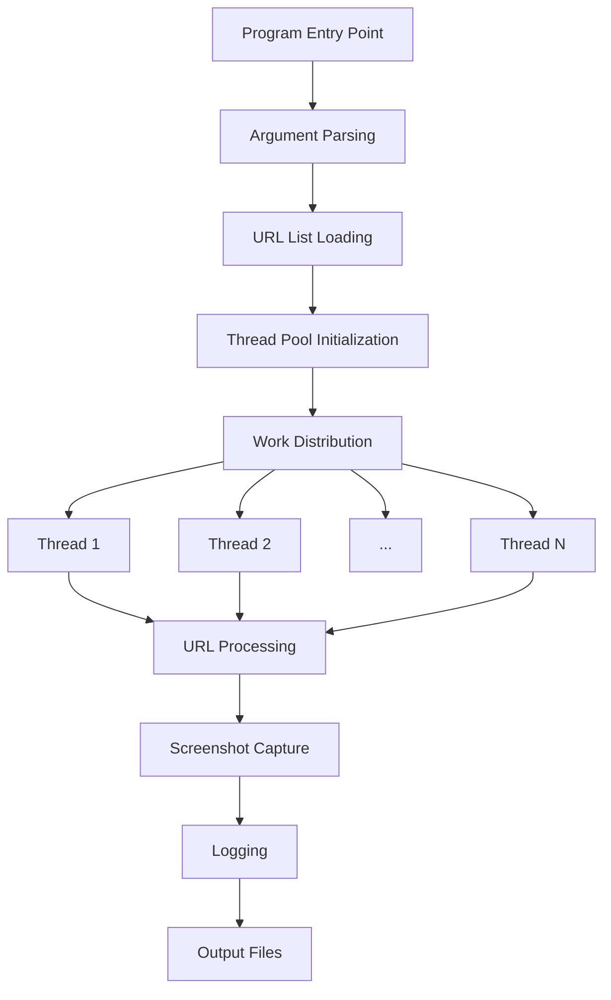

# Multi-Threaded URL Visiting Feature Design

## 1. Overview

This document outlines the design for implementing a multi-threaded URL visiting feature in the ScreenShotter application. The feature will allow the application to process URLs from input files (such as `urllist.txt` or `list.txt`) concurrently using multiple threads, with a default of 10 threads. This enhancement will significantly improve the performance when processing large lists of URLs.

## 2. Current Architecture Analysis

The current ScreenShotter application is a .NET 6.0 console application that:
- Takes a single URL or a file containing a list of URLs as input
- Uses Selenium WebDriver with Chrome in headless mode to visit each URL
- Captures screenshots of the visited pages
- Logs results to a file or console

The application processes URLs sequentially, which can be time-consuming when dealing with large URL lists.

## 3. Proposed Architecture

The multi-threaded implementation will modify the URL processing loop to distribute URL visits across multiple threads while maintaining thread safety for shared resources like the log file and screenshot directory.

### 3.1 Component Architecture



### 3.2 Thread Management

- A thread pool with a configurable number of threads (default 10)
- Each thread will process a subset of URLs from the input list
- Work distribution will be balanced across threads
- Shared resources (log file, screenshot directory) will be accessed in a thread-safe manner

## 4. Implementation Details

### 4.1 Command Line Interface

The application will accept a new command-line argument to specify the number of threads:

```
WebSShooter <url or url_list_file> [--threads <count>] [--out <folder>] [--log <logfile>] [--log-format <text|json>]
```

Example usage:
```
WebSShooter urllist.txt --threads 15
WebSShooter urllist.txt --threads 5 --out ./screenshots --log results.log
```

### 4.2 Core Modifications

#### 4.2.1 Thread Pool Implementation

A new method will be added to distribute the work among threads, creating a task for each thread to process its assigned URLs.

#### 4.2.2 Work Distribution

URLs will be distributed evenly among threads to ensure balanced workload across all threads.

#### 4.2.3 Thread-Safe Logging

Logging will be synchronized to prevent race conditions when multiple threads write to the log simultaneously.

### 4.3 Thread Safety Considerations

1. **Logging**: All log writes will be synchronized using a lock mechanism
2. **File I/O**: Screenshot files will be written to unique filenames to prevent conflicts
3. **WebDriver Instances**: Each thread will use its own WebDriver instance to avoid sharing issues

## 5. Data Models

### 5.1 URL Processing Result

| Field | Type | Description |
|-------|------|-------------|
| Url | String | The URL that was processed |
| Success | Boolean | Indicates if the processing was successful |
| FilePath | String | Path to the saved screenshot file |
| ErrorMessage | String | Error message if processing failed |
| ProcessedAt | DateTime | Timestamp when the URL was processed |

## 6. API Endpoints/Commands

### 6.1 New Command Line Arguments

| Argument | Description | Default |
|----------|-------------|---------|
| `--threads <count>` | Number of threads to use for processing URLs | 10 |
| `-t <count>` | Short form of --threads | 10 |

### 6.2 Usage Examples

1. Process URLs with default thread count (10):
   ```
   WebSShooter urllist.txt
   ```

2. Process URLs with custom thread count:
   ```
   WebSShooter urllist.txt --threads 20
   ```

3. Process URLs with custom thread count and output options:
   ```
   WebSShooter urllist.txt --threads 15 --out ./my_screenshots --log processing.log
   ```

## 7. Business Logic

### 7.1 Thread Management Logic

The application will implement a producer-consumer pattern where:
1. URLs are loaded from the input file
2. URLs are partitioned into chunks for distribution
3. Worker threads process their assigned URL chunks
4. Results are collected and reported

### 7.2 Error Handling

Each thread will handle exceptions independently:
- Errors in one thread won't affect others
- Error details will be logged with the associated URL
- Failed URLs will be clearly marked in the log

### 7.3 Resource Management

- Each thread will create its own WebDriver instance
- WebDriver instances will be properly disposed of after use
- File handles will be closed immediately after use

## 8. Performance Considerations

### 8.1 Thread Count Optimization

- Default of 10 threads balances performance with resource usage
- Too many threads may overwhelm the system or target servers
- Users can adjust thread count based on their system capabilities

### 8.2 Memory Usage

- Each WebDriver instance consumes memory
- URL chunks are loaded into memory
- Screenshots are written directly to disk to minimize memory usage

## 9. Testing Strategy

### 9.1 Unit Tests

1. Test URL partitioning logic with various input sizes
2. Test command-line argument parsing for thread count
3. Test thread-safe logging with concurrent access

### 9.2 Integration Tests

1. Test multi-threaded processing with a small URL list
2. Verify all URLs are processed exactly once
3. Verify screenshots are correctly saved
4. Verify logging is thread-safe and complete

## 10. Configuration

### 10.1 Default Values

| Setting | Value | Description |
|---------|-------|-------------|
| Default Thread Count | 10 | Number of threads used if not specified |
| WebDriver Timeout | 30 seconds | Time to wait for page load |
| Screenshot Format | PNG | Format for saved screenshots |

### 10.2 Customization Options

Users can customize thread count via command-line arguments.

## 11. Backward Compatibility

The implementation will maintain full backward compatibility:
- Existing command-line interface remains unchanged
- Default behavior (single-threaded) can be maintained by setting thread count to 1
- All existing functionality continues to work as before

## 12. Implementation Approach

### 12.1 Core Implementation Strategy
1. Extend argument parsing to support thread count parameter
2. Implement URL partitioning mechanism for workload distribution
3. Create multi-threaded processing framework
4. Ensure thread-safe access to shared resources

### 12.2 Quality Assurance
1. Unit testing of new components
2. Performance testing with various thread counts
3. Memory usage optimization
4. Error handling validation

### 12.3 Deployment Considerations
1. Update user documentation
2. Provide examples in help text
3. Conduct final validation testing